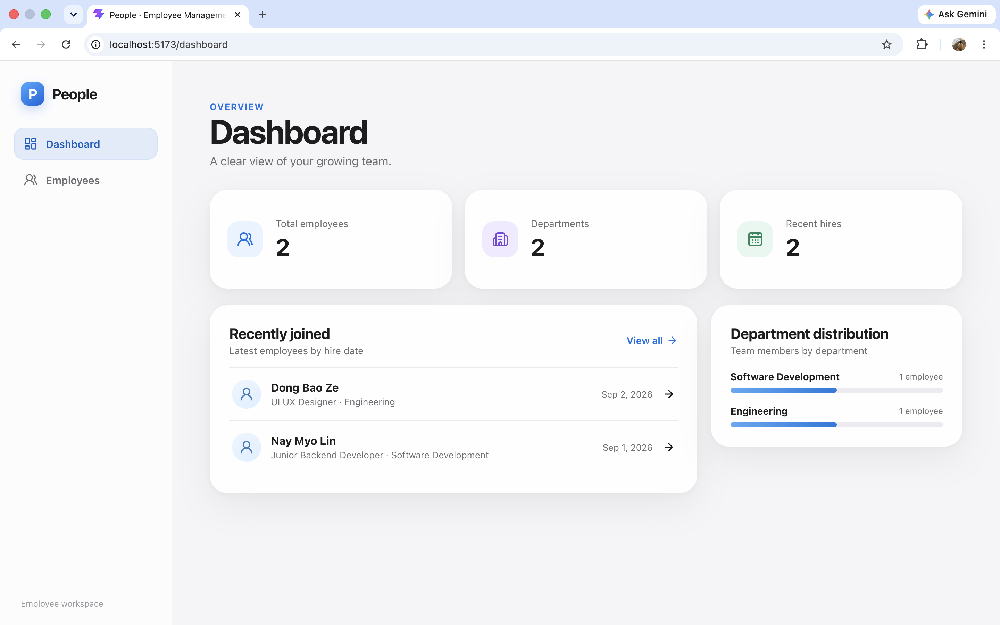
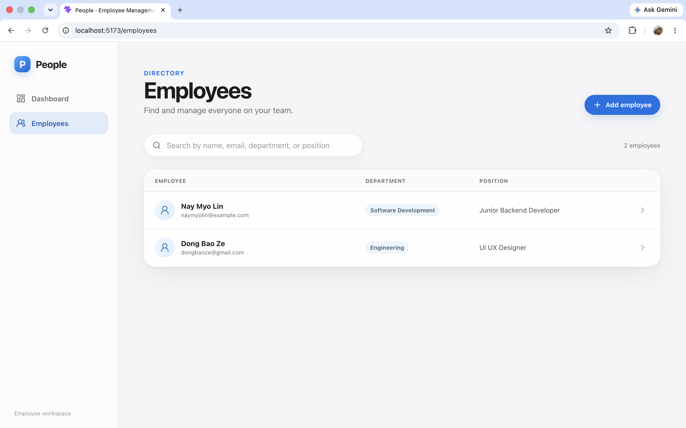
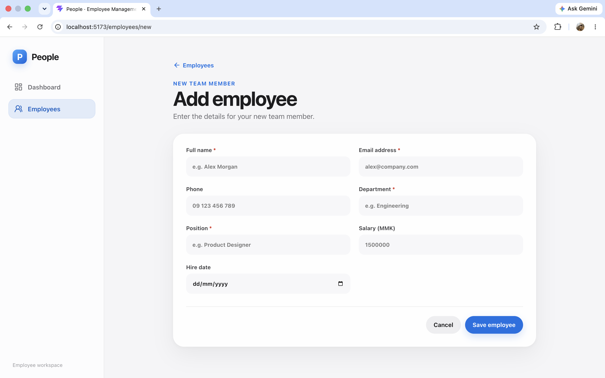
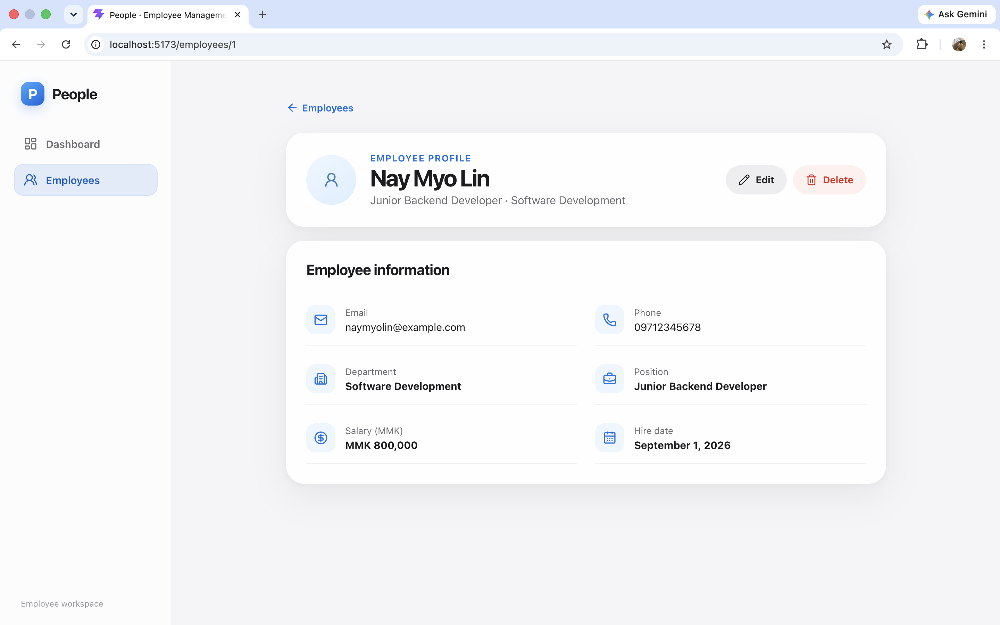
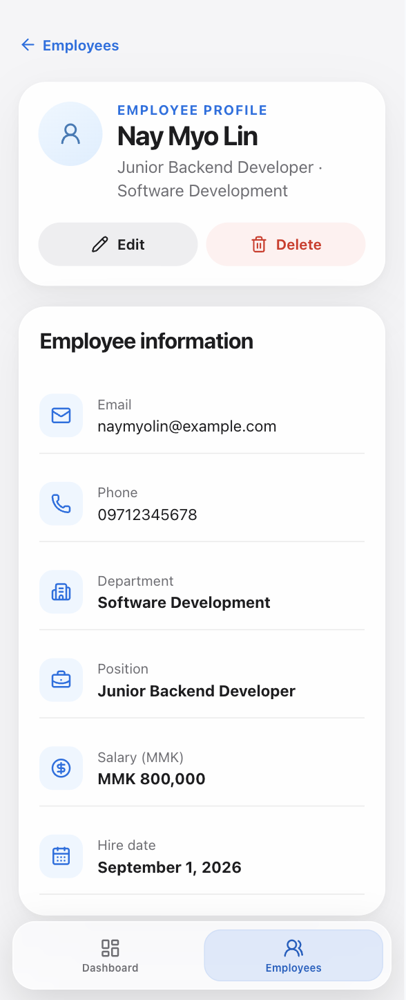

# Employee Management System

## Project Overview

Employee Management System is a full-stack web application for organizing employee records through a responsive, polished interface. It combines a React single-page application with a Spring Boot REST API and PostgreSQL persistence.

The application provides a data-driven dashboard, employee search, complete CRUD workflows, validation feedback, and responsive layouts designed for desktop and mobile use.

## Features

- Dynamic dashboard calculated from live employee data
- Department distribution with employee counts and proportional indicators
- Recently hired employees sorted by hire date
- Create, read, update, and delete employee records
- Search by name, email, department, or position
- Client-side and server-side validation
- Dedicated handling for HTTP `400`, `404`, and `409` responses and network failures
- Skeleton loading states that reduce layout shifts
- Success and error toast notifications
- Confirmation dialog for destructive actions
- Responsive Apple-inspired interface with desktop sidebar and mobile bottom navigation
- Accessible focus states, ARIA announcements, and reduced-motion support

## Screenshots

### Dashboard



### Employees



### Add Employee



### Employee Details



### Mobile Responsive View



## Tech Stack

### Backend

- Java 21
- Spring Boot 4.1.1
- Spring Web MVC
- Spring Data JPA
- Jakarta Bean Validation
- PostgreSQL JDBC Driver
- Lombok
- Maven Wrapper
- JUnit, MockMvc, and Mockito

### Frontend

- React 19.2.8
- React DOM 19.2.8
- React Router DOM 7.18.3
- Axios 1.20.0
- Lucide React 1.39.0
- Vite 8.2.2
- ESLint 10.9.0
- Plain CSS without a UI framework

### Infrastructure

- PostgreSQL 17 Alpine
- Docker Compose

## Architecture

```text
React + Vite frontend
        │
        │  HTTP / JSON via Axios
        ▼
Spring Boot REST API
        │
        │  Spring Data JPA
        ▼
PostgreSQL database
```

During local development, Vite proxies requests from `/api` to the Spring Boot server at `http://localhost:8080`.

The backend follows a layered structure:

- **Controller:** Defines REST endpoints and HTTP responses.
- **Service:** Implements employee operations and duplicate-email checks.
- **Repository:** Provides database access through Spring Data JPA.
- **Model:** Defines the persisted employee entity and validation constraints.
- **Exception handling:** Produces consistent validation and API error responses.

## Project Structure

```text
employee-management-system/
├── backend/
│   ├── src/main/java/com/naymyolin/employee_management/
│   │   ├── controller/
│   │   ├── exception/
│   │   ├── model/
│   │   ├── repository/
│   │   └── service/
│   ├── src/main/resources/application.properties
│   ├── src/test/
│   ├── mvnw
│   └── pom.xml
├── frontend/
│   ├── src/
│   │   ├── api/
│   │   ├── components/
│   │   └── pages/
│   ├── package.json
│   └── vite.config.js
├── docs/screenshots/
├── scripts/start-backend.sh
├── .env.example
├── docker-compose.yml
└── README.md
```

## Employee Fields

| Field | Type | Required | Description |
| --- | --- | --- | --- |
| `id` | Long | Generated | Database-generated employee identifier |
| `name` | String | Yes | Employee's full name; cannot be blank |
| `email` | String | Yes | Valid, unique email address |
| `phone` | String | No | Optional phone number, up to 30 characters |
| `department` | String | Yes | Employee's department; cannot be blank |
| `position` | String | Yes | Employee's position; cannot be blank |
| `salary` | BigDecimal | No | Optional salary in Myanmar Kyat; cannot be negative |
| `hireDate` | LocalDate | No | Optional hire date in `YYYY-MM-DD` format |

## REST API Endpoints

The local API base URL is `http://localhost:8080/api/employees`.

| Method | Endpoint | Description | Success status |
| --- | --- | --- | --- |
| `GET` | `/api/employees` | Retrieve all employees | `200 OK` |
| `GET` | `/api/employees/{id}` | Retrieve one employee | `200 OK` |
| `POST` | `/api/employees` | Create an employee | `201 Created` |
| `PUT` | `/api/employees/{id}` | Replace an employee's editable fields | `200 OK` |
| `DELETE` | `/api/employees/{id}` | Delete an employee | `204 No Content` |

## Validation and Error Handling

The frontend validates required fields, email formatting, phone length, and non-negative salary values before submission. The backend independently applies the corresponding entity validation rules.

API errors use the following responses:

- `400 Bad Request` for validation failures, including field-level messages
- `404 Not Found` when an employee ID does not exist
- `409 Conflict` when an email address is already in use
- A network-error state when the frontend cannot reach the API

Forms display validation feedback near the affected fields, while page-level failures provide retry actions and toast notifications.

## Prerequisites

Install the following tools before running the project:

- Java 21
- Docker Desktop with Docker Compose
- Node.js and npm compatible with Vite 8

Maven does not need to be installed globally because the repository includes Maven Wrapper.

## Environment Configuration

Create a local environment file from the safe example:

```bash
cp .env.example .env
```

Open `.env` and replace the example database username and password with your local PostgreSQL values. Keep the JDBC database name consistent with `POSTGRES_DB`.

The required variables are:

```dotenv
POSTGRES_DB=employee_db
DB_URL=jdbc:postgresql://localhost:5432/employee_db
DB_USERNAME=your_postgres_username
DB_PASSWORD=your_postgres_password
```

The local `.env` file is ignored by Git and must never be committed. Docker Compose reads the root `.env` automatically. Spring Boot does not, so the provided backend script explicitly exports these variables before starting the application.

## Running the Project

Run each service in a separate terminal from the project root.

### 1. Start PostgreSQL

```bash
docker compose up -d
```

### 2. Start the backend

```bash
./scripts/start-backend.sh
```

The API starts at `http://localhost:8080`.

### 3. Start the frontend

```bash
cd frontend
npm install
npm run dev
```

Open [http://localhost:5173](http://localhost:5173) in a browser.

## Testing

### Backend

Load the root environment variables before running Maven tests:

```bash
cd backend
set -a
source ../.env
set +a
./mvnw test
```

The backend test suite contains:

- 9 `EmployeeController` tests covering CRUD operations, validation, not-found responses, and duplicate-email conflicts
- 1 application context test
- 10 tests in total

### Frontend

```bash
cd frontend
npm run lint
npm run build
```

## Security and Configuration

- Database connection values are supplied through environment variables.
- The local `.env` file is excluded from version control.
- `.env.example` contains placeholders only and is safe to share.
- API errors are handled without exposing database implementation details in the UI.
- Build output, dependency directories, logs, and local IDE files are excluded through `.gitignore`.

For a production environment, use platform-managed secrets rather than storing credentials in repository files.

## Responsive Design

The interface uses a persistent sidebar on desktop and a fixed, safe-area-aware bottom navigation on mobile. Employee records use a structured desktop list and compact mobile cards. Forms, profile details, skeleton states, dialogs, and toast notifications adapt to narrow screens without requiring horizontal scrolling.

The visual system uses a light-gray background, translucent white surfaces, rounded cards, subtle borders, soft shadows, pill-shaped actions, and system fonts. Motion is intentionally restrained and respects the operating system's reduced-motion preference.

## Future Improvements

- Add pagination and server-side filtering for larger employee directories
- Add authentication and role-based authorization
- Add frontend component and end-to-end tests
- Add API documentation with OpenAPI
- Containerize the backend and frontend services
- Add CI checks for backend tests, frontend linting, and production builds
- Prepare environment-specific production deployment configuration

## Author

**Nay Myo Lin**
