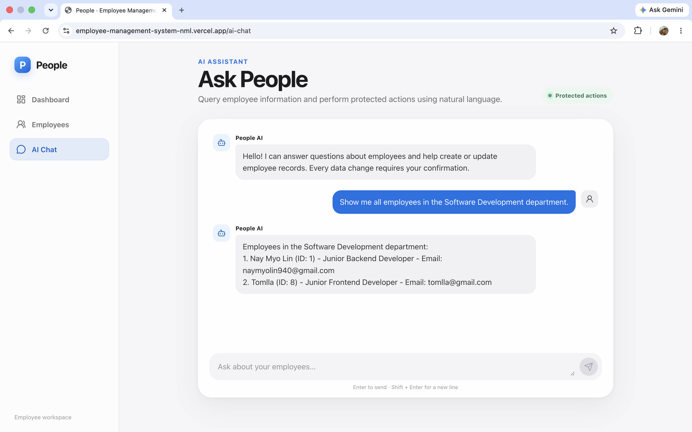
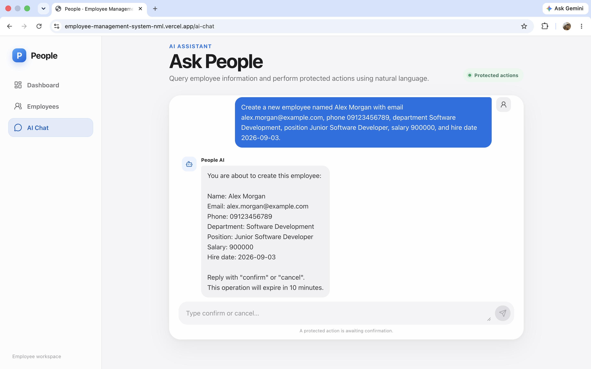
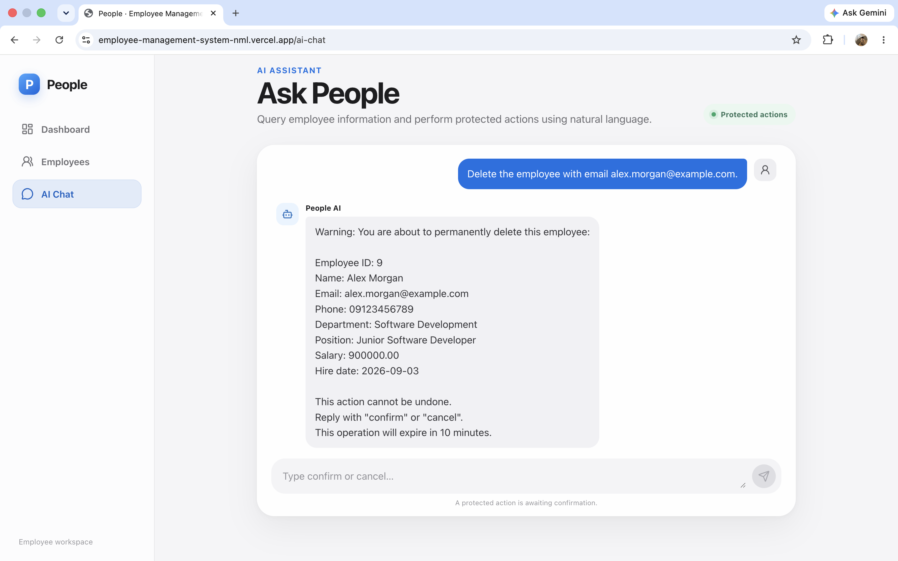
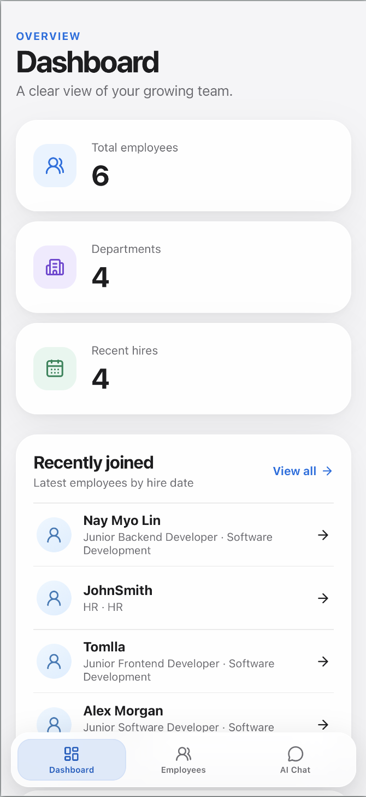

# Employee Management System

A full-stack employee workspace with a responsive React interface, a Spring Boot REST API, PostgreSQL persistence, and a confirmation-protected AI assistant powered through OpenRouter.

## Live Demo

- **Frontend:** [employee-management-system-nml.vercel.app](https://employee-management-system-nml.vercel.app)
- **Backend API:** [employee-management-system-aqed.onrender.com/api/employees](https://employee-management-system-aqed.onrender.com/api/employees)

> The Render free instance may sleep while idle. Its first request after a period of inactivity can take approximately 50 seconds or longer.

## Project Overview

Employee Management System is a portfolio-ready CRUD application for maintaining employee records and understanding team composition. The dashboard derives live headcount, department distribution, and recent-hire information from the API. A searchable directory leads to employee profiles and complete create, edit, and delete workflows.

The project also includes an AI assistant that interprets natural-language employee requests. Read-only questions are answered from employee data supplied by the backend, while every proposed create, update, or delete operation is held behind an explicit confirmation step.

## Key Features

- Data-driven dashboard with total employees, department count, recent hires, and department distribution
- Searchable employee directory filtered by name, email, department, or position
- Employee profile pages with contact, role, salary, and hire-date details
- Complete create, read, update, and delete workflows
- Client-side form checks and independent server-side Jakarta Bean Validation
- Duplicate-email protection with `409 Conflict` responses
- Skeleton loading UI, empty states, retryable error states, and network-error feedback
- Success and error toast notifications
- Permanent-delete confirmation dialog for standard UI deletions
- Responsive desktop sidebar, mobile cards, and safe-area-aware bottom navigation
- Accessible labels, live regions, focus styles, keyboard-friendly dialogs, and reduced-motion support

## AI Assistant Features

The **Ask People** page sends natural-language requests to `POST /api/chat`. `AiChatService` provides the current employee list to OpenRouter as data, requests a structured decision, and classifies the result as `QUERY`, `CREATE`, `UPDATE`, `DELETE`, or `CLARIFY`.

- Answers questions about current employee records without changing data
- Prepares employee creation when the required name, email, department, and position are supplied
- Updates one safely identified employee by ID, current email, or an unambiguous current name
- Deletes one safely identified employee and refuses ambiguous name matches
- Requests clarification when required information is missing or a target cannot be identified safely
- Validates AI-supplied email, salary, and hire-date values before preparing an action
- Retries the OpenRouter request once when the model returns an invalid structured response
- Uses the configured OpenRouter model; the code default is `openrouter/free`, overridable with `OPENROUTER_MODEL`

## AI Safety and Confirmation Workflow

```text
Natural-language request
          |
          v
  OpenRouter classification
          |
    +-----+-----------------------------+
    |                                   |
 QUERY / CLARIFY                CREATE / UPDATE / DELETE
    |                                   |
 Immediate reply                 Validate and identify target
                                        |
                                 Show proposed-action summary
                                        |
                            Wait for confirm / cancel (10 minutes)
                                        |
                           EmployeeService -> Repository -> PostgreSQL
```

- Read-only queries do not require destructive-action confirmation.
- Create, update, and delete requests return a summary before anything is written.
- The client retains the returned `confirmationToken` and prompts the user to reply with `confirm` or `cancel` (`yes` and `no` are also accepted by the backend).
- Any other reply leaves the operation pending and repeats the confirmation guidance.
- Pending operations are stored in backend memory and expire after **600 seconds (10 minutes)**. Expired or unknown tokens cannot execute an action.
- Delete previews include a permanent-deletion warning and state that the action cannot be undone.
- Confirmed mutations call `EmployeeService.createEmployee`, `updateEmployee`, or `deleteEmployee`. AI actions therefore use the same business logic, duplicate-email checks, and persistence path as the REST controllers; the assistant does not directly modify PostgreSQL.
- The backend limits an AI update or deletion to exactly one safely identified employee.

## Screenshots

### Dashboard


### Employee Directory


### Add Employee


### AI Employee Query



### AI Create Confirmation



### AI Delete Confirmation



### Mobile Responsive View



## Tech Stack

| Area | Technologies |
| --- | --- |
| Frontend | React 19.2.8, React DOM 19.2.8, React Router DOM 7.18.3, Axios 1.20.0, Lucide React 1.39.0, plain CSS |
| Frontend tooling | Vite 8.2.2, ESLint 10.9.0 |
| Backend | Java 21, Spring Boot 4.1.1, Spring Web MVC, Spring Data JPA, Jakarta Bean Validation, Lombok |
| Database | PostgreSQL, PostgreSQL JDBC driver; PostgreSQL 17 Alpine for local Docker Compose |
| AI | OpenRouter Chat Completions-compatible API via Spring `RestClient` |
| Testing | JUnit 5, MockMvc, Mockito, Spring Boot Test |
| Deployment | Vercel frontend, Render backend, Supabase PostgreSQL production database |

## System Architecture

```text
Standard application flow

React + Vite SPA
      |
      | Axios / JSON
      v
Spring Boot controllers
      v
EmployeeService
      v
EmployeeRepository (Spring Data JPA)
      v
PostgreSQL

AI-assisted flow

AI Chat page
      v
POST /api/chat -> AiChatController -> AiChatService
                                      |          |
                                      |          +-> OpenRouter
                                      |
                                      +-> controlled EmployeeService operations
                                                   v
                                            JPA -> PostgreSQL
```

In local development, Vite serves the SPA on port `5173` and proxies `/api` to Spring Boot on port `8080`; Docker Compose provides PostgreSQL on port `5432`. In production, Vercel serves the SPA, `VITE_API_BASE_URL` points it to the Render origin, Render runs the Spring Boot API, and the backend connects to Supabase PostgreSQL through environment-managed credentials.

## Project Structure

```text
employee-management-system/
├── backend/
│   ├── src/main/java/com/naymyolin/employee_management/
│   │   ├── config/CorsConfig.java
│   │   ├── controller/
│   │   │   ├── AiChatController.java
│   │   │   └── EmployeeController.java
│   │   ├── dto/
│   │   ├── exception/
│   │   ├── model/Employee.java
│   │   ├── repository/EmployeeRepository.java
│   │   └── service/
│   │       ├── AiChatService.java
│   │       ├── EmployeeService.java
│   │       └── PendingEmployee*.java
│   ├── src/main/resources/application.properties
│   ├── src/test/java/com/naymyolin/employee_management/
│   ├── mvnw
│   └── pom.xml
├── frontend/
│   ├── src/
│   │   ├── api/
│   │   ├── components/
│   │   └── pages/
│   ├── package.json
│   ├── vercel.json
│   └── vite.config.js
├── docs/screenshots/
├── scripts/start-backend.sh
├── .env.example
├── docker-compose.yml
└── README.md
```

## Employee Fields

| Field | Java type | Required | Rules |
| --- | --- | --- | --- |
| `id` | `Long` | Generated | PostgreSQL identity value |
| `name` | `String` | Yes | Must not be blank |
| `email` | `String` | Yes | Must not be blank, must be a valid email, and must be unique |
| `phone` | `String` | No | Database column and frontend input allow up to 30 characters |
| `department` | `String` | Yes | Must not be blank |
| `position` | `String` | Yes | Must not be blank |
| `salary` | `BigDecimal` | No | Precision 12, scale 2; must be zero or positive; displayed as MMK |
| `hireDate` | `LocalDate` | No | ISO date format: `YYYY-MM-DD` |

## REST API Endpoints

Local employee API base: `http://localhost:8080/api/employees`

| Method | Endpoint | Purpose | Success response |
| --- | --- | --- | --- |
| `GET` | `/api/employees` | Return all employees | `200 OK` with an array |
| `GET` | `/api/employees/{id}` | Return one employee by ID | `200 OK` |
| `POST` | `/api/employees` | Create an employee | `201 Created` |
| `PUT` | `/api/employees/{id}` | Update all editable employee fields | `200 OK` |
| `DELETE` | `/api/employees/{id}` | Delete an employee | `204 No Content` |

## AI Chat Endpoint

`POST /api/chat` accepts JSON in this form:

```json
{
  "message": "Update employee 42's department to Platform Engineering",
  "confirmationToken": null
}
```

`message` is required, must not be blank, and is limited to 1,000 characters. `confirmationToken` is omitted or `null` for a new request and returned to the endpoint with a later `confirm` or `cancel` message.

Example response for an action awaiting confirmation:

```json
{
  "reply": "You are about to update this employee: ...",
  "confirmationRequired": true,
  "confirmationToken": "server-generated-token",
  "dataChanged": false
}
```

After successful confirmation, `dataChanged` becomes `true`; the current frontend dispatches an `employees:changed` event to signal the mutation.

## Validation and Error Handling

The React form checks required fields, email shape, the 30-character phone limit, and non-negative numeric salary before submission. The backend independently validates required fields, email format, and non-negative salary. `EmployeeService` also rejects duplicate emails during both create and update operations.

| Status | Meaning |
| --- | --- |
| `400 Bad Request` | Request validation failed; the backend returns a `validationErrors` object |
| `404 Not Found` | The requested employee ID does not exist |
| `409 Conflict` | The email address is already in use |

Page-level failures expose retry actions where appropriate. Forms and mutations show readable alerts or toast notifications, and Axios timeouts/network failures receive dedicated user-facing messages.

## Prerequisites

- Java 21
- Docker Desktop or another Docker installation with Compose
- Node.js `^20.19.0` or `>=22.12.0` (required by the installed Vite 8 package)
- npm

The Maven Wrapper is included, so a global Maven installation is not required.

## Environment Configuration

Copy the safe example before local development:

```bash
cp .env.example .env
```

The following names are read by the current code or startup configuration. Use placeholders and keep real values outside version control.

```dotenv
# Docker Compose and PostgreSQL
POSTGRES_DB=employee_db
DB_URL=jdbc:postgresql://localhost:5432/employee_db
DB_USERNAME=your_postgres_username
DB_PASSWORD=your_postgres_password

# Required for the AI service
OPENROUTER_API_KEY=your_openrouter_api_key

# Optional backend overrides (defaults shown)
OPENROUTER_BASE_URL=https://openrouter.ai/api/v1
OPENROUTER_MODEL=openrouter/free
CORS_ALLOWED_ORIGINS=http://localhost:5173
JPA_SHOW_SQL=false
PORT=8080

# Frontend production build; use the backend origin, without /api
VITE_API_BASE_URL=https://your-backend.example.com
```

`POSTGRES_DB` is consumed by Docker Compose and checked by `scripts/start-backend.sh`; Spring Boot reads the `DB_*`, OpenRouter, CORS, JPA, and port variables. The frontend appends `/api` to `VITE_API_BASE_URL`. Multiple CORS origins may be supplied as a comma-separated list.

Never commit `.env`, database URLs containing credentials, Supabase passwords, or OpenRouter API keys. The repository's `.gitignore` excludes `.env` and `.env.*` files while allowing safe `.env.example` templates.

## Local Setup and Running Instructions

1. Clone the repository and enter it:

   ```bash
   git clone https://github.com/NayMyoLin940/employee-management-system.git
   cd employee-management-system
   ```

2. Copy `.env.example` to `.env`, configure the local PostgreSQL values, and add `OPENROUTER_API_KEY`.

3. Start PostgreSQL:

   ```bash
   docker compose up -d
   ```

4. Start the backend from the project root:

   ```bash
   ./scripts/start-backend.sh
   ```

   The REST API is available at `http://localhost:8080`. The helper script loads the root `.env` before running `./mvnw spring-boot:run` inside `backend/`.

5. In a second terminal, install and start the frontend:

   ```bash
   cd frontend
   npm install
   npm run dev
   ```

6. Open [http://localhost:5173](http://localhost:5173). Vite forwards local `/api` requests to `http://localhost:8080`.

## Testing

The backend currently declares **22 JUnit tests**:

- 9 `EmployeeControllerTest` MockMvc tests covering CRUD responses, validation, missing employees, and duplicate-email conflicts
- 12 `AiChatServiceTest` unit tests covering protected update and delete preparation, confirmation, cancellation, invalid tokens, missing or ambiguous targets, pending-state behavior, and invalid-AI-response retry
- 1 application context smoke test

Run the backend suite with the environment variables required to create the Spring application context:

```bash
cd backend
set -a
source ../.env
set +a
./mvnw test
```

The frontend has lint and production-build checks but no component or end-to-end test suite at present:

```bash
cd frontend
npm run lint
npm run build
```

## Deployment

### Frontend — Vercel

Deploy `frontend/` as the project root, use the Vite build command and `dist` output, and set `VITE_API_BASE_URL` to the Render backend origin. `frontend/vercel.json` rewrites SPA routes to `index.html`, allowing direct navigation to React Router pages.

### Backend — Render

Deploy the Spring Boot application from `backend/` with Java 21. Configure `DB_URL`, `DB_USERNAME`, `DB_PASSWORD`, `OPENROUTER_API_KEY`, `OPENROUTER_BASE_URL`, `OPENROUTER_MODEL`, and `CORS_ALLOWED_ORIGINS` as Render environment variables. Render supplies `PORT`, which Spring Boot reads with a local default of `8080`.

Free Render instances may sleep after inactivity, so the first API request can require approximately 50 seconds or longer.

### Production Data and AI

- **Database:** Supabase PostgreSQL, connected through a platform-managed JDBC URL and credentials
- **AI provider:** OpenRouter, called only by the Spring Boot backend; the browser never receives the API key

## Security Considerations

- No authentication or role-based authorization is implemented; production deployments should restrict access before storing sensitive workforce data.
- Secrets belong in local ignored files or deployment-platform secret stores, never in Git or client-side `VITE_*` variables.
- CORS is limited to configured origins for `/api/**` and permits only `GET`, `POST`, `PUT`, `DELETE`, and `OPTIONS`.
- AI-provided employee content is framed as data in the system prompt, and ambiguous destructive targets are rejected.
- AI mutations require a server-generated confirmation token and still pass through `EmployeeService`.
- Salary, phone, and other employee fields are sent to the configured AI provider when processing a new chat request. Review privacy, retention, and regulatory requirements before using real employee data.
- Pending AI actions are held only in backend memory and removed on confirmation, cancellation, expiration cleanup, or process restart.
- Hibernate schema mode is currently `update`; production schema migrations would provide stronger operational control.

## Responsive Design

The layout switches at `760px`: the desktop sidebar becomes a fixed, safe-area-aware bottom navigation, multi-column forms and details become single-column, directory rows become mobile cards, and action buttons expand for touch use. Additional layout adjustments at `1020px` keep the dashboard and directory readable on tablets. The UI also respects `prefers-reduced-motion`.

## Known Limitations

- There is no authentication, authorization, or audit trail.
- Employee listing, search, and AI context loading operate on the complete dataset; there is no server-side pagination or filtering.
- Pending AI operations are in-memory and instance-local, so they do not survive restarts or reliably span multiple backend instances.
- The default `openrouter/free` router does not pin a specific underlying model; responses can vary unless `OPENROUTER_MODEL` is configured explicitly.
- The AI service sends the full employee list in each new request, which does not scale well and may not satisfy all privacy requirements.
- Automated frontend tests and dedicated AI create/query tests are not currently present.
- The frontend emits an `employees:changed` event after an AI mutation, but no current component subscribes to that event; other views refresh when they next load.
- Server validation errors use the `validationErrors` property, while the current frontend API helper looks for `fields`; server-side field errors therefore fall back to the form-level validation message.

## Future Improvements

- Add authentication, role-based access control, and an immutable audit log
- Add pagination, sorting, and server-side search
- Persist confirmation workflows in Redis or a database for multi-instance reliability
- Send only the minimum necessary employee context to the AI provider and add explicit data-governance controls
- Pin a production AI model and add observability, rate limiting, and cost controls
- Add OpenAPI documentation and database migrations with Flyway or Liquibase
- Add frontend unit/component tests, end-to-end coverage, and broader AI create/query/expiration tests
- Add CI checks for backend tests, frontend linting, and production builds

## Author

**Nay Myo Lin** — [GitHub](https://github.com/NayMyoLin940)
